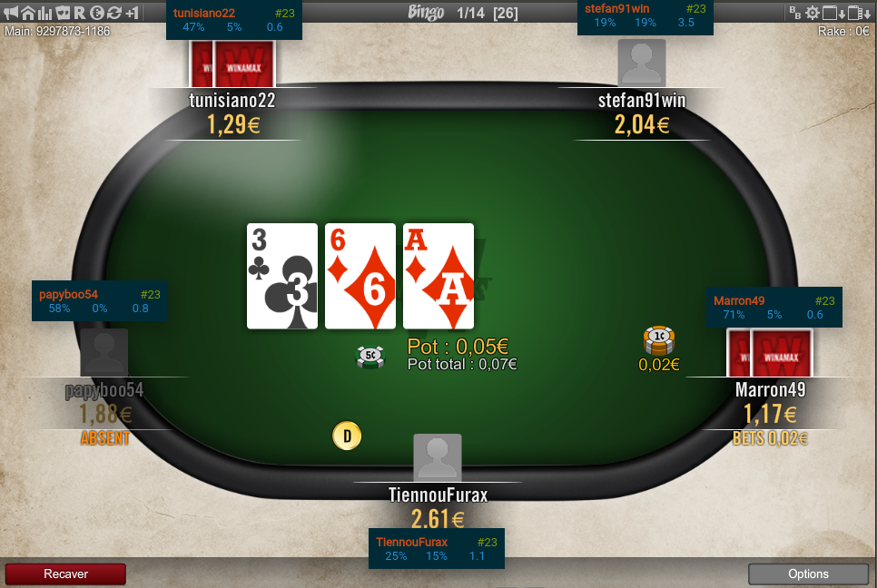
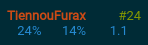
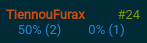

# poker-hud

A simple HUD for [Winamax Poker](https://www.winamax.fr/en/) software. 

When a file changes inside the hand history directory, the app parses it, computes some statistics and displays a widget per player around the table. Currently the app doesn't create a database so statistics are based on one single hand history file.



## HUD



The widget shows the player's name, the number of hands for this player and from left to right:
* Voluntary put money in the pot
* PreFlop Raise
* Agression Factor



Click on the statistics to shows alternative metrics:
* Percentage of continuation bet
* Percentage of fold on continuation bet

These metrics are followed by the total number of opportunity to do so.

## Setup and run

``` bash
# install dependencies
npm install
```

```javascript
// Edit app/main.js
function onReady() {
    hud.watch('YOUR_HAND_HISTORY_DIRECTORY');
}
```

``` bash
# run
electron app
```
